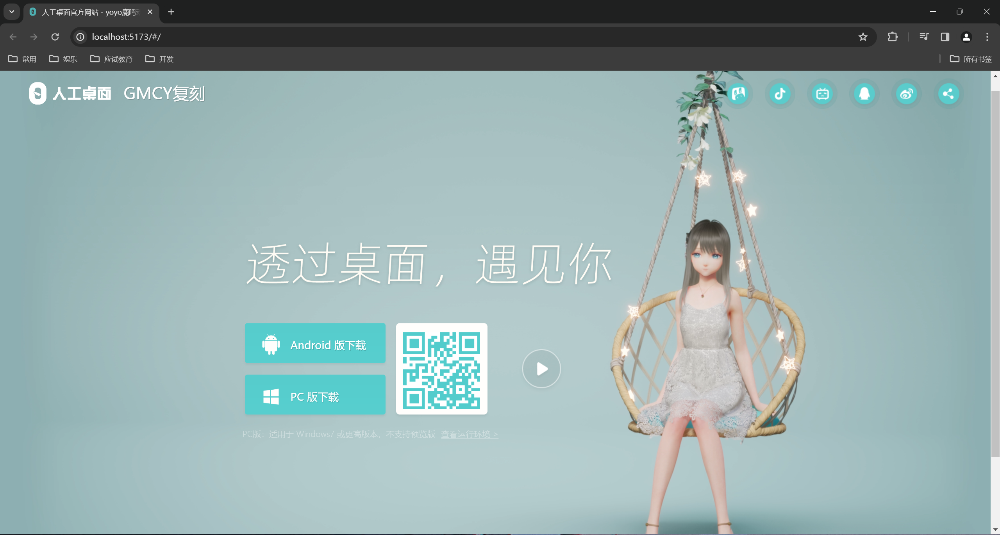
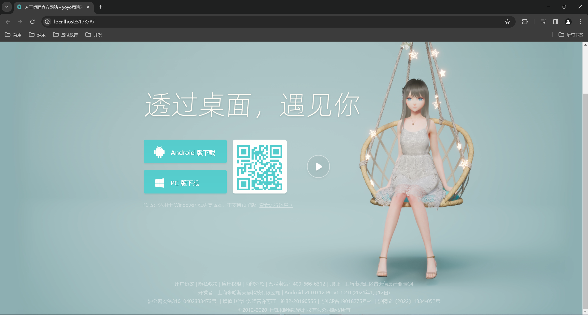
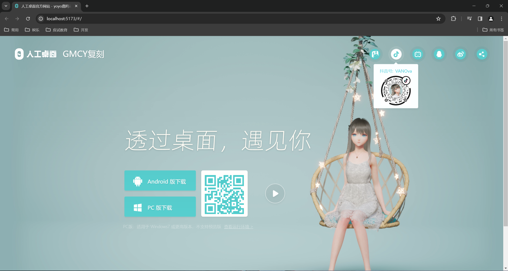
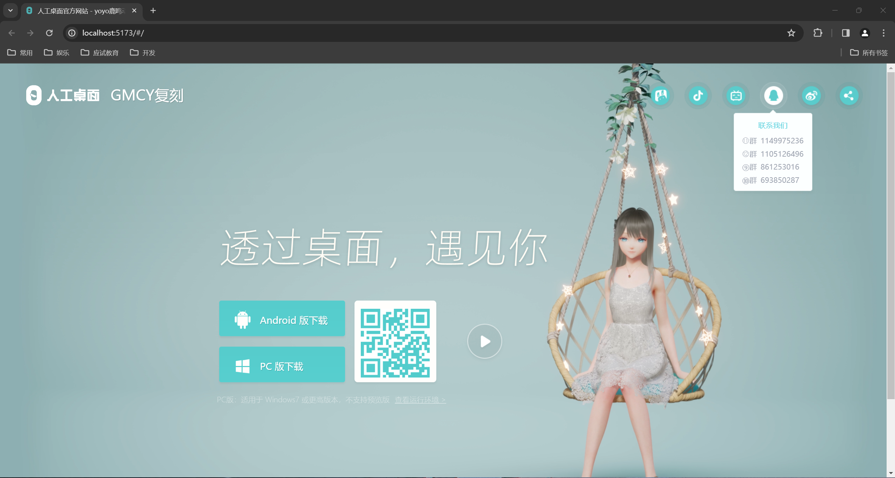
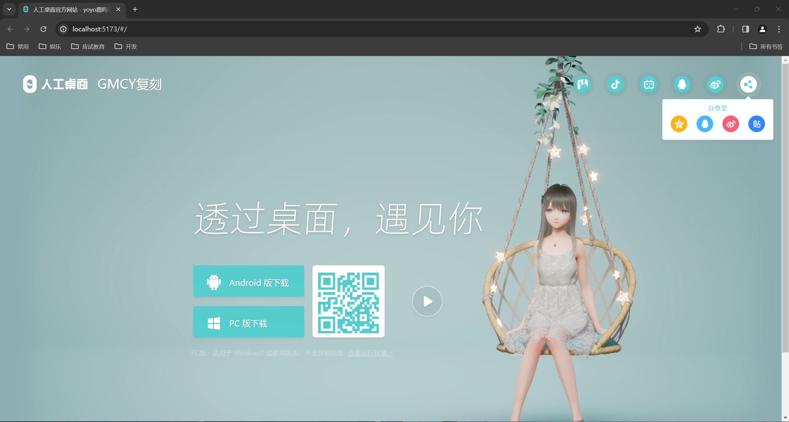
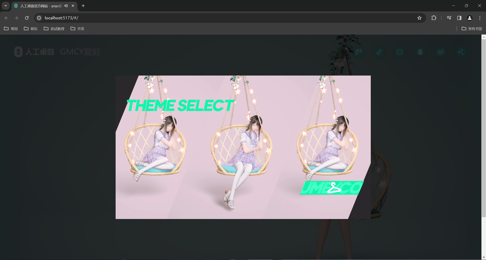
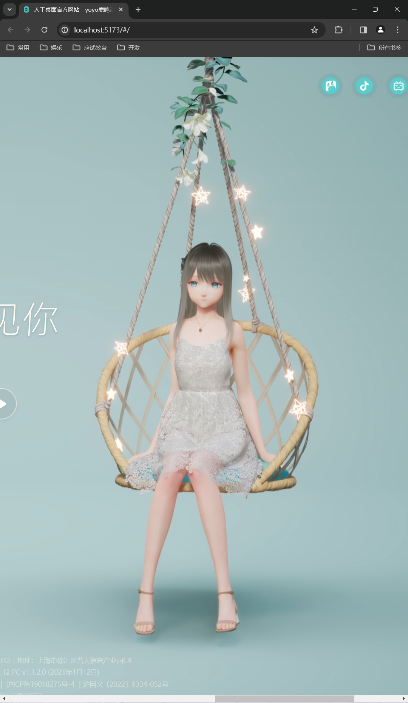

# 复刻人工桌面官网

## 1. 基本信息

- 作者: GMCY
- 系列: 复刻系列
- 网站: [人工桌面官网-复刻的](https://gmcy2020.github.io/Reprint-N0vaDesktop-Web/)
- 仓库: [GitHub](https://github.com/GMCY2020/Reprint-N0vaDesktop-Web) | [Gitee](https://gitee.com/GMCY2020/Reprint-N0vaDesktop-Web)
- 话题(GitHub): [vue](https://github.com/topics/vue) \ [reprint](https://github.com/topics/reprint) \ [mihoyo](https://github.com/topics/mihoyo) \ [n0vadesktop](https://github.com/topics/n0vadesktop) \ [desktopPet](https://github.com/topics/desktopPet)
- 创建时间: 2024/01/15

## 2. 介绍

- 项目参考 [人工桌面官网-国内](https://n0va.mihoyo.com/#/) , 进行模仿
- 项目图片视频等资源来自人工桌面官网, 仅编程学习用
- 人工桌面官网的样式参考创建时间前的
- 基本信息中的网站, 国内访问GitHub网络问题. 可能有延迟, 图片未更新, 图片未加载等问题. 项目下载到本地应该不卡.
- 个人学习自用

## 3. 环境

编辑器

- `VSCode`

框架

- `vue3`

## 4. 效果图

PC端

手机端
 